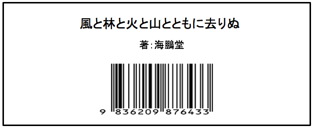

<html><head>
    <meta http-equiv="content-type" content="text/html; charset=utf-8">
    <title>Lend (Book Management)</title>
  </head>

  <body>
    

      <h1>貸出バーコード発行画面</h1>
    
  
    

      <input type="submit" value="ログアウト" onclick="logOut()">
    

    
    

    
    

      
貸出バーコード発行完了いたしました

      

      <table border="1">
        <form action="list.html" method="get"></form>
        <tbody>
	      <tr>
            <th>
              題名
            </th>
            <th>
              風と林と火と山とともに去りぬ
            </th>
         </tr>
	       <tr>
            <th>
              発行日時
            </th>
            <th>
              2019/02/15 15:14:56
            </th>
          </tr>
          <tr>
            <th>
              バーコード
            </th>
            <th>
              
            </th>          
          </tr>
        </tbody>
      </table>
    

    

  
    

      <a href="https://takajo-soft08.github.io/Create/MainPagePARENT/">_Back_To_Home_</a>
    

  

</body></html>
